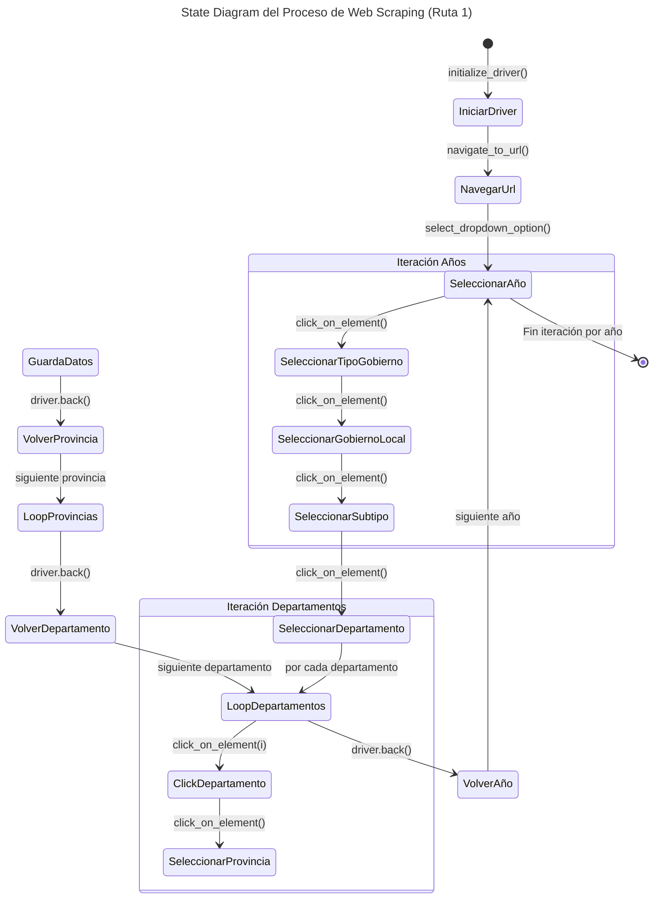

# Web Scraping: ENAHO 2004–2025 <a id='a'></a>

Este proyecto en **Stata** proporciona una solución automatizada para descargar, organizar y procesar la **Encuesta Nacional de Hogares (ENAHO)** del Perú a partir del portal oficial de [**Microdatos**](https://proyectos.inei.gob.pe/microdatos/) del **Instituto Nacional de Estadística e Informática (INEI)**, utilizando la **metodología actualizada**. El script permite obtener la información disponible para todos los años comprendidos entre **2004 y 2025**.

El objetivo principal es automatizar la descarga de todos los módulos de la encuesta directamente desde los servidores oficiales del INEI. Además, el script descomprime automáticamente los archivos en formato **`.zip`**, lo que permite construir un flujo de trabajo eficiente, reproducible y fácilmente actualizable para el procesamiento de los microdatos. En aquellos casos en que los archivos comprimidos presenten errores o inconsistencias, el script conserva el archivo descargado y notifica al usuario que la extracción deberá realizarse manualmente.

El proceso sigue una estructura jerárquica de iteración, recorriendo primero los **años de la encuesta** (identificados mediante el **Código de Encuesta**) y, posteriormente, los **módulos** (identificados mediante el **Código de Módulo**). Esta estructura facilita la descarga masiva de la información y permite personalizar fácilmente los años o módulos que se desean procesar.

Con el propósito de garantizar la reproducibilidad, la trazabilidad y el mantenimiento del proyecto, el código se gestiona mediante **Git** y se encuentra alojado en **GitHub**, lo que facilita el control de versiones, la documentación de los cambios y la colaboración con otros usuarios.

## Contenido
___
1. [**Requisitos**](#1)
2. [**Instalación**](#2)
3. [**Estructura del Proyecto**](#3)
4. [**Uso**](#4)
4. [**Observaciones**](#5)
___

## 1. Requisitos <a id='1'></a>
___
Para ejecutar este proyecto únicamente se requiere:
- **Stata 16** o superior.
- Permisos de escritura en el directorio donde se almacenarán los archivos descargados.
- **Git** (opcional), para clonar el repositorio.
---

## 2. Instalación 🚀 <a id='2'></a>

### 2.1. Clonar el repositorio

1. Abrir una terminal o línea de comandos Git Bash.

2. Ejecutar el siguiente comando para clonar el repositorio en tu máquina local:
```bash
git clone https://github.com/CarloEduardo/01-Web-Scraping-ENAHO-2004-2025.git
```
3. Establecer como directorio de trabajo la carpeta clonada.
```
cd \E:\07. GitHub\01-Web-Scraping-ENAHO-2004-2025\
```

## 3. Uso <a id="3"></a>
___
1. Abrir el archivo 
```bash
Download-ENAHO-2004-2025.do
```

2. Modificar la ruta donde se almacenarán los archivos descargados.
```stata
global Path = "D:\MiProyecto\Web-Scraping-ENAHO-2004-2025"
```

3. Si lo deseas, modificar el rango de años:
```stata
local year_start = 4
local year_end   = 25
```

4. Seleccionar los módulos que deseas descargar:
```stata
foreach j in 1 2 3 4 5 {
```
___

5. Ejecutar el script.

## 4. Estructura del proyecto 📂<a id="4"></a>
___
```text
.
├── Download-ENAHO-2004-2025.do
├── 01-ENAHO/
│   ├──2004/
│   ├──2005/
│   ├──...
│   └──2025/
│
├── LICENSE
└── README.md
```
___

## 5. Funcionamiento del script <a id="5"></a>
___
El script realiza automáticamente las siguientes tareas:

1. Crea la estructura de carpetas del proyecto.
2. Recorre los años seleccionados.
3. Obtiene el Código de Encuesta correspondiente a cada año.
4. Recorre los módulos seleccionados.
5. Descarga cada archivo ZIP desde el portal oficial del INEI.
6. Descomprime automáticamente cada archivo.
7. Conserva el archivo ZIP cuando ocurre un error durante la extracción.

El proceso completo puede resumirse mediante el siguiente flujo:

```text
Seleccionar años
        │
        ▼
Crear carpetas
        │
        ▼
Iterar por año
        │
        ▼
Iterar por módulos
        │
        ▼
Descargar ZIP
        │
        ▼
Descomprimir
        │
        ├─────────────► Error
        │                  │
        ▼                  ▼
Finaliza         Mantener ZIP para extracción manual
```
___

## 6. Módulos disponibles <a id="6"></a>

*(Aquí conservaría exactamente la tabla que ya elaboraste.)*

Módulos

Este script incluye el tratamiento de los siguientes módulos:
___
<table>
<thead><tr>
<th><strong>Nro</strong></th>
<th><strong>Módulo</strong></th>
<th><strong>Descripción</strong></th>
</tr>
</thead>
<tbody>
<tr>
<td>1</td>
<td>Módulo 1</td>
<td>Características de la Vivienda y del Hogar</td>
</tr>
<tr>
<td>2</td>
<td>Módulo 2</td>
<td>Características de los Miembros del Hogar</td>
</tr>
<tr>
<td>3</td>
<td>Módulo 3</td>
<td>Educación</td>
</tr>
<tr>
<td>4</td>
<td>Módulo 4</td>
<td>Salud</td>
</tr>
<tr>
<td>5</td>
<td>Módulo 5</td>
<td>Empleo e Ingresos</td>
</tr>
<tr>
<td>6</td>
<td>Módulo 7</td>
<td>Gastos en Alimentos y Bebidas/td>
</tr>
<tr>
<td>7</td>
<td>Módulo 8</td>
<td>Instituciones Benéficas</td>
</tr>
<tr>
<td>8</td>
<td>Módulo 9</td>
<td>Mantenimiento de la Vivienda</td>
</tr>
<tr>
<td>9</td>
<td>Módulo 10</td>
<td>Transportes y Comunicaciones</td>
</tr>
<tr>
<td>10</td>
<td>Módulo 11</td>
<td>Servicios de la Vivienda</td>
</tr>
<tr>
<td>11</td>
<td>Módulo 12</td>
<td>Esparcimiento, Diversión y Servicios Culturales</td>
</tr>
<tr>
<td>12</td>
<td>13</td>
<td>Vestido y Calzado</td>
</tr>
<tr>
<td>13</td>
<td>Módulo 15</td>
<td>Gastos de Transferencias</td>
</tr>
<tr>
<td>14</td>
<td>Módulo 16</td>
<td>Muebles y Enseres</td>
</tr>
<tr>
<td>15</td>
<td>Módulo 17</td>
<td>Otros Bienes y Servicios</td>
</tr>
<tr>
<td>16</td>
<td>Módulo 18</td>
<td>Equipamiento del Hogar</td>
</tr>
<tr>
<td>17</td>
<td>22</td>
<td>Producción Agrícola</td>
</tr>
<tr>
<td>18</td>
<td>Módulo 23</td>
<td>Subproductos Agrícolas</td>
</tr>
<tr>
<td>19</td>
<td>Módulo 24</td>
<td>Producción Forestal</td>
</tr>
<tr>
<td>20</td>
<td>Módulo 25</td>
<td>Gastos en Actividades Agrícolas y/o Forestales</td>
</tr>
<tr>
<td>21</td>
<td>26</td>
<td>Producción Pecuaria</td>
</tr>
<tr>
<td>22</td>
<td>Módulo 27</td>
<td>Subproductos Pecuarios</td>
</tr>
<tr>
<td>23</td>
<td>Módulo 28</td>
<td>Gastos en Actividades Pecuarias</td>
</tr>
<tr>
<td>24</td>
<td>Módulo 34</td>
<td>Variables Calculadas (Resumen)</td>
</tr>
<tr>
<td>25</td>
<td>Módulo 37</td>
<td>Programas Sociales</td>
</tr>
<tr>
<td>26</td>
<td>Módulo 77</td>
<td>Ingresos del Trabajador Independiente</td>
</tr>
<tr>
<td>27</td>
<td>Módulo 78</td>
<td>Bienes y Servicios para el Cuidado Personal</td>
</tr>
<tr>
<td>28</td>
<td>Módulo 84</td>
<td>Participación Ciudadana</td>
</tr>
<tr>
<td>29</td>
<td>Módulo 85</td>
<td>Gobernabilidad, Democracia y Transparencia</td>
</tr>
<tr>
<td>30</td>
<td>Módulo 1825</td>
<td>Beneficiarios de Instituciones sin fines de lucro: Olla Común</td>
</tr>
</tbody>
</table>
___

## 7. Resultado <a id="7"></a>
___
Al finalizar la ejecución se obtiene una estructura similar a la siguiente:

```text
01-ENAHO/
│
├──2004/
│   ├── enaho01-2004.dta
│   ├── enaho02-2004.dta
│   └── ...
│
├──2005/
│
├──...
│
└──2025/
```

Cada carpeta contiene todos los módulos descargados y extraídos para el año correspondiente.
___

## 8. Observaciones <a id="8"></a>
___
En algunos años, determinados archivos ZIP publicados por el INEI presentan inconsistencias que impiden su extracción automática mediante Stata.

Cuando esto ocurre, el script conserva el archivo comprimido y muestra un mensaje indicando que la extracción debe realizarse manualmente.
___

## 9. Licencia <a id="9"></a>
___
Este proyecto se distribuye bajo la licencia **MIT**.

Consulta el archivo **LICENSE** para obtener más información.
___

## 10. Contacto <a id="10"></a>
___
**Carlos Eduardo Torres García**

[](https://www.linkedin.com/in/carlo4-eduardo-torres-garcia/)

[](https://x.com/Carlo4_Eduardo)
___

[**⬆ Volver al inicio**](#a)


El siguiente diagrama muestra la lógica de todo el proceso para el caso de la **RUTA N°1: MUNICIPALIDADES**.


*Elaboración propia.* <br>
***Nota:** Este diagrama muestra el flujo de navegación y extracción de datos, detallando las iteraciones en la automatización. Implícitamente, después de cada `click_on_element()`, se ejecuta `switch_to_frame()`.*  


## Resultado 📂<a id='3'></a>

```
01-ENAHO/ 
│ 
├──2004/ 
│ ├── enaho01-2004.dta 
│ ├── enaho02-2004.dta 
│ └── ... 
│ 
├──2005/ 
│ 
├──... 
│ 
└──2025/
```

## ⚠️ Observaciones

En algunos años, determinados archivos ZIP publicados por el INEI presentan inconsistencias que impiden su extracción automática mediante Stata.

Cuando esto ocurre, el script muestra un mensaje indicando que el archivo debe descomprimirse manualmente. El archivo ZIP descargado se conserva para facilitar este proceso.

## Licencia
Este proyecto está licenciado bajo la Licencia MIT. Consulta el archivo [LICENSE](/LICENSE) para más detalles.

## Contactos

[](https://www.linkedin.com/in/carlo4-eduardo-torres-garcia/)
[](https://x.com/Carlo4_Eduardo)

[**Subir ↑**](#a)