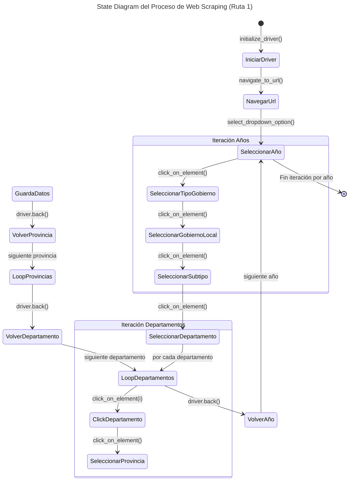

# Web Scraping: ENAHO 2004-2025 <a id='a'></a>

Este proyecto en **Stata** proporciona una forma eficiente e integral de descargar, organizar y procesar la **Encuesta de hogares del Perú (ENAHO)** del portal [Microdatos](https://proyectos.inei.gob.pe/microdatos/) (Metodología ACTUALIZADA) del **Instituto Nacional de Estadística e Informática**para todos los años disponibles, desde 2004 hasta 2025.

El objetivo ES automatiza la descarga de todos los módulos de la encuesta directamente desde las fuentes oficiales. Además, extrae automáticamente los archivos comprimidos (.zip), lo que permite construir un flujo de trabajo reproducible y eficiente para el procesamiento de datos. No obstante, en aquellos casos en que los archivos comprimidos presenten errores o inconsistencias, la extracción deberá realizarse de forma manual.

El proceso sigue una estructura jerárquica, iterando por los **años** definidos en las **Código Encuesta** y **modulo** definido por el **Código de Modulo**. 

Para garantizar la trazabilidad y colaboración en el desarrollo, el proyecto se gestiona con **Git** y está alojado en **GitHub**, lo que permite el control de versiones y contribuciones de otros usuarios.

## Contenido
1. [**Requisitos**](#1)
2. [**Instalación**](#2)
3. [**Estructura del Proyecto**](#3)
4. [**Uso**](#4)
___

## 1. Requisitos <a id='1'></a>

Este proyecto fue desarrollado con:
* **Stata 16**
* **Git** (recomendado para clonar el repositorio)

Para ejecutar se necesita tener instaladas las siguientes dependencias:

## 2. Instalación y uso 🚀 <a id='2'></a>

### 2.1. Clonar el repositorio

1. Abrir una terminal o línea de comandos Git Bash.

2. Ejecutar el siguiente comando para clonar el repositorio en tu máquina local:
```bash
git clone https://github.com/CarloEduardo/01-Web-Scraping-ENAHO-2004-2025.git
```
3. Establecer como directorio de trabajo la carpeta clonada.
```bash
cd \E:\07. GitHub\01-Web-Scraping-ENAHO-2004-2025\
```
### 2.2. Uso 

1. Abrir el archivo 'Download-ENAHO-2004-2025.do' en Stata.

2. Modificar la ruta de trabajo:
global Path = "D:\MiProyecto\Web-Scraping-ENAHO-2004-2025"

3. Ejecutar el script.

## 3. Estructura del proyecto 📂<a id='3'></a>

```
├── Download-ENAHO-2004-2025.do  # Script de Web-scraping
│
├── ENAHO/
│   ├── 2004/
│   ├── 2005/
│   ├── ...
│   └── 2024/
│
└── README.md
```

A continuación se describe el script del web-scraping (*Download-ENAHO-2004-2025.do*)

### 3.1. `a_config.py`

Define rutas, parámetros de ejecución, navegación en la web y procesamiento de datos. 

* Configuración del directorio y URL.

| **Variable**       | **Descripción**                           |
|--------------------|-------------------------------------------|
| `PATH_BASE`        | Directorio principal                        |
| `PATH_DATA_RAW`    | Ruta donde se almacenan los datos crudos  |
| `PATH_DATA_PRO`    | Ruta donde se guardan los datos preprocesados |
| `PATH_DRIVER`      | Ubicación del WebDriver                   |
| `URL`              | Plataforma de la cual se extraen los datos |

El siguiente diagrama muestra la lógica de todo el proceso para el caso de la **RUTA N°1: MUNICIPALIDADES**.


*Elaboración propia.* <br>
***Nota:** Este diagrama muestra el flujo de navegación y extracción de datos, detallando las iteraciones en la automatización. Implícitamente, después de cada `click_on_element()`, se ejecuta `switch_to_frame()`.*  

### 4.2. Ajustar parámetros en `a_config.py`
 
Los valores predeterminados no requieren modificaciones, excepto `YEARS`, que debe modificarse según los años de interés para la extracción de datos.

1. Abrir el `a_config.py`.

2. Definir el rango de años.
```python
YEARS = list(range(2024, 2026))
```
Como resultado definirá los años 2024-2025 para el scraping (al definir un rango Python no incluye el rango superior).

3. Guardar los cambios y cerrar `a_config.py`.

Módulos

Este script incluye el tratamiento de los siguientes módulos:

<table>
<thead><tr>
<th><strong>Nro</strong></th>
<th><strong>Módulo</strong></th>
<th><strong>Descripción</strong></th>
</tr>
</thead>
<tbody>
<tr>
<td>1</td>
<td>Módulo 1</td>
<td>Características de la Vivienda y del Hogar</td>
</tr>
<tr>
<td>2</td>
<td>Módulo 2</td>
<td>Características de los Miembros del Hogar</td>
</tr>
<tr>
<td>3</td>
<td>Módulo 3</td>
<td>Educación</td>
</tr>
<tr>
<td>4</td>
<td>Módulo 4</td>
<td>Salud</td>
</tr>
<tr>
<td>5</td>
<td>Módulo 5</td>
<td>Empleo e Ingresos</td>
</tr>
<tr>
<td>6</td>
<td>Módulo 7</td>
<td>Gastos en Alimentos y Bebidas/td>
</tr>
<tr>
<td>7</td>
<td>Módulo 8</td>
<td>Instituciones Benéficas</td>
</tr>
<tr>
<td>8</td>
<td>Módulo 9</td>
<td>Mantenimiento de la Vivienda</td>
</tr>
<tr>
<td>9</td>
<td>Módulo 10</td>
<td>Transportes y Comunicaciones</td>
</tr>
<tr>
<td>10</td>
<td>Módulo 11</td>
<td>Servicios de la Vivienda</td>
</tr>
<tr>
<td>11</td>
<td>Módulo 12</td>
<td>Esparcimiento, Diversión y Servicios Culturales</td>
</tr>
<tr>
<td>12</td>
<td>13</td>
<td>Vestido y Calzado</td>
</tr>
<tr>
<td>13</td>
<td>Módulo 15</td>
<td>Gastos de Transferencias</td>
</tr>
<tr>
<td>14</td>
<td>Módulo 16</td>
<td>Muebles y Enseres</td>
</tr>
<tr>
<td>15</td>
<td>Módulo 17</td>
<td>Otros Bienes y Servicios</td>
</tr>
<tr>
<td>16</td>
<td>Módulo 18</td>
<td>Equipamiento del Hogar</td>
</tr>
<tr>
<td>17</td>
<td>22</td>
<td>Producción Agrícola</td>
</tr>
<tr>
<td>18</td>
<td>Módulo 23</td>
<td>Subproductos Agrícolas</td>
</tr>
<tr>
<td>19</td>
<td>Módulo 24</td>
<td>Producción Forestal</td>
</tr>
<tr>
<td>20</td>
<td>Módulo 25</td>
<td>Gastos en Actividades Agrícolas y/o Forestales</td>
</tr>
<tr>
<td>21</td>
<td>26</td>
<td>Producción Pecuaria</td>
</tr>
<tr>
<td>22</td>
<td>Módulo 27</td>
<td>Subproductos Pecuarios</td>
</tr>
<tr>
<td>23</td>
<td>Módulo 28</td>
<td>Gastos en Actividades Pecuarias</td>
</tr>
<tr>
<td>24</td>
<td>Módulo 34</td>
<td>Variables Calculadas (Resumen)</td>
</tr>
<tr>
<td>25</td>
<td>Módulo 37</td>
<td>Programas Sociales</td>
</tr>
<tr>
<td>26</td>
<td>Módulo 77</td>
<td>Ingresos del Trabajador Independiente</td>
</tr>
<tr>
<td>27</td>
<td>Módulo 78</td>
<td>Bienes y Servicios para el Cuidado Personal</td>
</tr>
<tr>
<td>28</td>
<td>Módulo 84</td>
<td>Participación Ciudadana</td>
</tr>
<tr>
<td>29</td>
<td>Módulo 85</td>
<td>Gobernabilidad, Democracia y Transparencia</td>
</tr>
<tr>
<td>30</td>
<td>Módulo 1825</td>
<td>Beneficiarios de Instituciones sin fines de lucro: Olla Común</td>
</tr>
</tbody>
</table>

## Resultado 📂<a id='3'></a>

```
01-ENAHO/ 
│ 
├──2004/ 
│ ├── enaho01-2004.dta 
│ ├── enaho02-2004.dta 
│ └── ... 
│ 
├──2005/ 
│ 
├──... 
│ 
└──2025/
```

## ⚠️ Observaciones

En algunos años, determinados archivos ZIP publicados por el INEI presentan inconsistencias que impiden su extracción automática mediante Stata.

Cuando esto ocurre, el script muestra un mensaje indicando que el archivo debe descomprimirse manualmente. El archivo ZIP descargado se conserva para facilitar este proceso.

## Licencia
Este proyecto está licenciado bajo la Licencia MIT. Consulta el archivo [LICENSE](/LICENSE) para más detalles.

## Contactos

[](https://www.linkedin.com/in/carlo4-eduardo-torres-garcia/)
[](https://x.com/Carlo4_Eduardo)

[**Subir ↑**](#a)