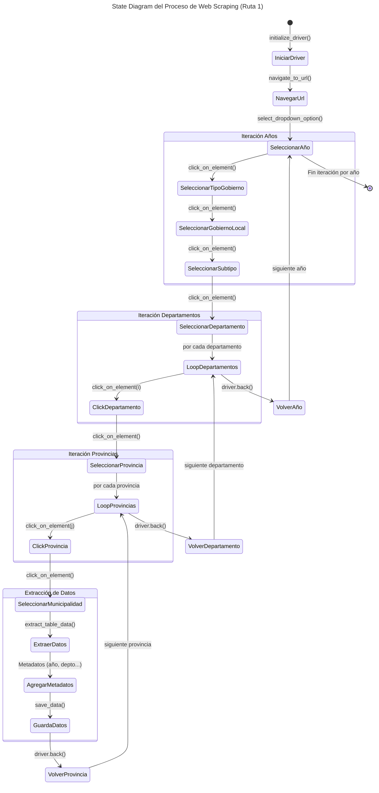

[](https://doi.org/10.5281/zenodo.14876919)

# Web Scraping: ENAHO 2004-2025 <a id='a'></a>

Este proyecto en **Stata** proporciona una forma eficiente e integral de descargar, organizar y procesar la **Encuesta de hogares del Perú (ENAHO)** del portal [Microdatos](https://proyectos.inei.gob.pe/microdatos/) (Metodología ACTUALIZADA) del **Instituto Nacional de Estadística e Informática**para todos los años disponibles, desde 2004 hasta 2025.

El objetivo ES automatiza la descarga de todos los módulos de la encuesta directamente desde las fuentes oficiales. Además, extrae automáticamente los archivos comprimidos (.zip), lo que permite construir un flujo de trabajo reproducible y eficiente para el procesamiento de datos. No obstante, en aquellos casos en que los archivos comprimidos presenten errores o inconsistencias, la extracción deberá realizarse de forma manual.

El proceso sigue una estructura jerárquica, iterando por los **años** definidos en las **Código Encuesta** y **modulo** definido por el **Código de Modulo**. 

Para garantizar la trazabilidad y colaboración en el desarrollo, el proyecto se gestiona con **Git** y está alojado en **GitHub**, lo que permite el control de versiones y contribuciones de otros usuarios.

## Contenido
1. [**Requisitos**](#1)
2. [**Instalación**](#2)
3. [**Estructura del Proyecto**](#3)
4. [**Uso**](#4)
___

## 1. Requisitos <a id='1'></a>

Este proyecto fue desarrollado con:
* **Stata 16**
* **Git** (recomendado para clonar el repositorio)

Para ejecutar se necesita tener instaladas las siguientes dependencias:

## 2. Instalación <a id='2'></a>

### 2.1. Clonar el repositorio

1. Abrir una terminal o línea de comandos Git Bash.

2. Ejecutar el siguiente comando para clonar el repositorio en tu máquina local:
```bash
git clone https://github.com/CarloEduardo/01-Web-Scraping-ENAHO-2004-2025.git
```

3. Establecer como directorio de trabajo la carpeta clonada.
```bash
cd \E:\07. GitHub\01-Web-Scraping-ENAHO-2004-2025\
```

## 3. 📂 Estructura del proyecto <a id='3'></a>

```
├── Download-ENAHO-2004-2025.do  # Scripts de Web-scraping
│
├── ENAHO/
│   ├── 2004/
│   ├── 2005/
│   ├── ...
│   └── 2024/
│
└── README.md
```

A continuación se describe el script del web-scraping (*Download-ENAHO-2004-2025.do*)

### 3.1. `a_config.py`

Define rutas, parámetros de ejecución, navegación en la web y procesamiento de datos. 

* Configuración del directorio y URL.

| **Variable**        | **Descripción**                           |
|---------------------|-------------------------------------------|
| `PATH_BASE`        | Directorio principal                        |
| `PATH_DATA_RAW`    | Ruta donde se almacenan los datos crudos  |
| `PATH_DATA_PRO`    | Ruta donde se guardan los datos preprocesados |
| `PATH_DRIVER`      | Ubicación del WebDriver                   |
| `URL`              | Plataforma de la cual se extraen los datos |

* Parámetros de Scraping y preprocesamiento

| **Variable**             | **Descripción**                                     |
|--------------------------|-----------------------------------------------------|
| `YEARS`                  | Rango de años `list(range(2015, 2026))` (no incluye el limite superior) |
| `GLOBAL_SELECTORS`       | Diccionario con selector de año y frame principal de la web|
| `ROUTES`                 | Diccionario de rutas con sus respectivos niveles y acciones a ejecutar |
| `FILE_CONFIGS`           | Diccionario con la configuración del archivo de salida, por cada ruta existente: <br> - `ENCABEZADOS_BASE` <br> - `ARCHIVO_SCRAPING`|
| `CLEANING_CONFIGS`       | Diccionario con el nombre las columnas a procesar (`ENCABEZADOS_BASE`) y los nuevos nombres, definidos por cada ruta existente.|


> [!NOTE]
> Este script define los parámetros de configuración que pueden ser modificados de acuerdo a las necesidades. El objetivo es separar la configuración de la lógica del código principal.


### 3.2. `b_scraper.py`

Este script es el núcleo del proceso de scraping. Su función principal es automatizar la navegación en el portal definido, extraer los datos y almacenarla en un archivo de salida.

* Carga la configuración desde `a_config.py`.
* Define funciones especializadas.

El script se compone de las siguientes funciones creadas:
| **Función**               | **Descripción**                           |
|---------------------------|-------------------------------------------|
|`initialize_driver()`      | Configura y lanza el WebDriver.|
|`navigate_to_url()`        | Accede a la URL objetivo.|
|`switch_to_frame()`        | Reinicia/cambia el contexto al frame especificado.|
|`click_on_element()`       | Hace clic en un elemento de la página.|
|`select_dropdown_option()` | Selecciona una opción en un desplegable.|
|`extract_table_data()`     | Extrae datos de una tabla en la web.|
|`get_final_headers()`      | Extrae los encabezados de la tabla en la web.|
|`navigate_levels()`          | Función recursiva que gestiona la navegación a través de los niveles jerárquicos.|
|`extract_data_by_year()`   | Inicia la navegación iterativa para extraer datos, utilizando el contexto definido.|
|`save_data()`              | Guarda los datos extraídos.|
|`select_route()`           | Solicita al usuario seleccionar una ruta de navegación. | 
|`main()`                   | Función principal que llama a las funciones en orden correcto.|

El siguiente diagrama muestra la lógica de todo el proceso para el caso de la **RUTA N°1: MUNICIPALIDADES**.


*Elaboración propia.* <br>
***Nota:** Este diagrama muestra el flujo de navegación y extracción de datos, detallando las iteraciones en la automatización. Implícitamente, después de cada `click_on_element()`, se ejecuta `switch_to_frame()`.*  

### 4.2. Ajustar parámetros en `a_config.py`
 
Los valores predeterminados no requieren modificaciones, excepto `YEARS`, que debe modificarse según los años de interés para la extracción de datos.

1. Abrir el `a_config.py`.

2. Definir el rango de años.
```python
YEARS = list(range(2024, 2026))
```
Como resultado definirá los años 2024-2025 para el scraping (al definir un rango Python no incluye el rango superior).

3. Guardar los cambios y cerrar `a_config.py`.

Módulos

Este script incluye el tratamiento de los siguientes módulos:

<table>
<thead><tr>
<th><strong>Nro</strong></th>
<th><strong>Código Módulo</strong></th>
<th><strong>Módulo</strong></th>
</tr>
</thead>
<tbody>
<tr>
<td>1</td>
<td>1</td>
<td>Características de la Vivienda y del Hogar</td>
</tr>
<tr>
<td>2</td>
<td>2</td>
<td>Características de los Miembros del Hogar</td>
</tr>
<tr>
<td>3</td>
<td>3</td>
<td>Educación</td>
</tr>
<tr>
<td>4</td>
<td>4</td>
<td>Salud</td>
</tr>
<tr>
<td>5</td>
<td>5</td>
<td>Empleo e Ingresos</td>
</tr>
<tr>
<td>6</td>
<td>7</td>
<td>Gastos en Alimentos y Bebidas/td>
<td>Numérico (entero)</td>
</tr>
<tr>
<td>7</td>
<td>8</td>
<td>Instituciones Benéficas</td>
<td>Categórico</td>
</tr>
<tr>
<td>8</td>
<td>9</td>
<td>Mantenimiento de la Vivienda</td>
<td>Categórico</td>
</tr>
<tr>
<td>9</td>
<td>10</td>
<td>Transportes y Comunicaciones</td>
<td>Categórico</td>
</tr>
<tr>
<td>10</td>
<td>11</td>
<td>Servicios de la Vivienda</td>
<td>Categórico</td>
</tr>
<tr>
<td>11</td>
<td>12</td>
<td>Esparcimiento, Diversión y Servicios Culturales</td>
<td>Categórico</td>
</tr>
<tr>
<td>12</td>
<td>13</td>
<td>Vestido y Calzado</td>
<td>Categórico</td>
</tr>
<tr>
<td>13</td>
<td>15</td>
<td>Gastos de Transferencias</td>
<td>Categórico</td>
</tr>
<tr>
<td>14</td>
<td>16</td>
<td>Muebles y Enseres</td>
<td>Categórico</td>
</tr>
<tr>
<td>15</td>
<td>17</td>
<td>Otros Bienes y Servicios</td>
<td>Categórico</td>
</tr>
<tr>
<td>16</td>
<td>18</td>
<td>Equipamiento del Hogar</td>
<td>Categórico</td>
</tr>
<tr>
<td>17</td>
<td>22</td>
<td>Producción Agrícola</td>
<td>Categórico</td>
</tr>
<tr>
<td>18</td>
<td>23</td>
<td>Subproductos Agrícolas</td>
<td>Categórico</td>
</tr>
<tr>
<td>19</td>
<td>24</td>
<td>Producción Forestal</td>
<td>Numérico (entero)</td>
</tr>
<tr>
<td>20</td>
<td>25</td>
<td>Gastos en Actividades Agrícolas y/o Forestales</td>
<td>Objeto</td>
</tr>
<tr>
<td>21</td>
<td>26</td>
<td>Producción Pecuaria</td>
<td>Categórico</td>
</tr>
<tr>
<td>22</td>
<td>27</td>
<td>Subproductos Pecuarios</td>
<td>Categórico</td>
</tr>
<tr>
<td>23</td>
<td>28</td>
<td>Gastos en Actividades Pecuarias</td>
<td>Categórico</td>
</tr>
<tr>
<td>24</td>
<td>34</td>
<td>Variables Calculadas (Resumen)</td>
<td>Categórico</td>
</tr>
<tr>
<td>25</td>
<td>37</td>
<td>Programas Sociales</td>
<td>Categórico</td>
</tr>
<tr>
<td>26</td>
<td>77</td>
<td>Ingresos del Trabajador Independiente</td>
<td>Categórico</td>
</tr>
<tr>
<td>27</td>
<td>78</td>
<td>Bienes y Servicios para el Cuidado Personal</td>
<td>Categórico</td>
</tr>
<tr>
<td>28</td>
<td>84</td>
<td>Participación Ciudadana</td>
<td>Categórico</td>
</tr>
<tr>
<td>29</td>
<td>85</td>
<td>Gobernabilidad, Democracia y Transparencia</td>
<td>Categórico</td>
</tr>
<tr>
<td>30</td>
<td>Beneficiarios de Instituciones sin fines de lucro: Olla Común</td>
<td>Categórico</td>
</tr>
</tbody>
</table>

### 4.3. Ejecutar el `b_scraper.py`

1. Para iniciar el **scraper** ejecutar el siguiente comando en la terminal CMD dentro del directorio del proyecto:

```cmd
python 02_src\b_scraper.py
```

2. Le mostrará la lista de rutas de navegación disponible. Debe elegir una ruta introduciendo el número.

```cmd
--- Rutas disponibles ---
1: MUNICIPALIDADES
2: SECTORES

Elige una ruta (número):
```

3. Una vez finalice correctamente saldrá el siguiente mensaje.
```cmd
✅ Proceso finalizado, driver cerrado.
```


## Licencia
Este proyecto está licenciado bajo la Licencia MIT. Consulta el archivo [LICENSE](/LICENSE) para más detalles.

## Contactos

[](https://www.linkedin.com/in/carlo4-eduardo-torres-garcia/)
[](https://x.com/Carlo4_Eduardo)

[**Subir ↑**](#a)